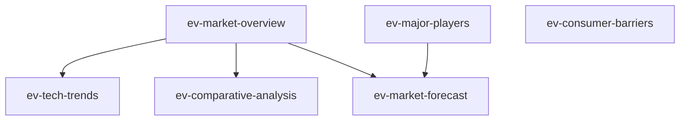
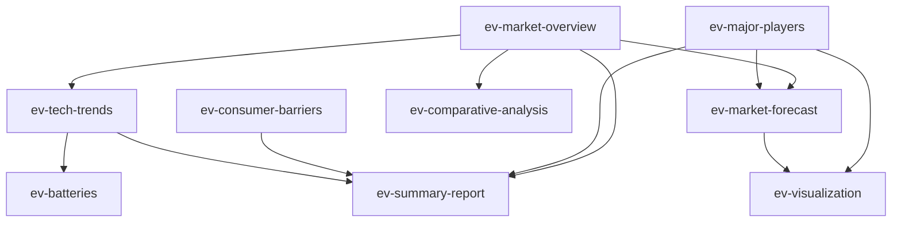

# 修正的完整层次依赖关系 DAG

## Epoch 1 DAG图

```mermaid
graph TD
    node1[ev-market-overview]
    node2[ev-major-players]
    node3[ev-consumer-barriers]
```

## Epoch 2 DAG图

```mermaid
graph TD
    %% Epoch 1节点(已完成)
    node1[ev-market-overview]
    node2[ev-major-players]
    node3[ev-consumer-barriers]
    
    %% Epoch 2节点(正在执行)
    node4[ev-tech-trends]
    node5[ev-comparative-analysis]
    node6[ev-market-forecast]
    
    %% 所有依赖关系
    node1 --> node4
    node1 --> node5
    node1 --> node6
    node2 --> node6
```

## Epoch 3 DAG图

```mermaid
graph TD
    %% Epoch 1节点(已完成)
    node1[ev-market-overview]
    node2[ev-major-players]
    node3[ev-consumer-barriers]
    
    %% Epoch 2节点(已完成)
    node4[ev-tech-trends]
    node5[ev-comparative-analysis]
    node6[ev-market-forecast]
    
    %% Epoch 3节点(正在执行)
    node7[ev-batteries]
    node8[ev-summary-report]
    node9[ev-visualization]
    
    %% 所有依赖关系
    node1 --> node4
    node1 --> node5
    node1 --> node6
    node1 --> node8
    node2 --> node6
    node2 --> node8
    node2 --> node9
    node3 --> node8
    node4 --> node7
    node4 --> node8
    node6 --> node9
```
