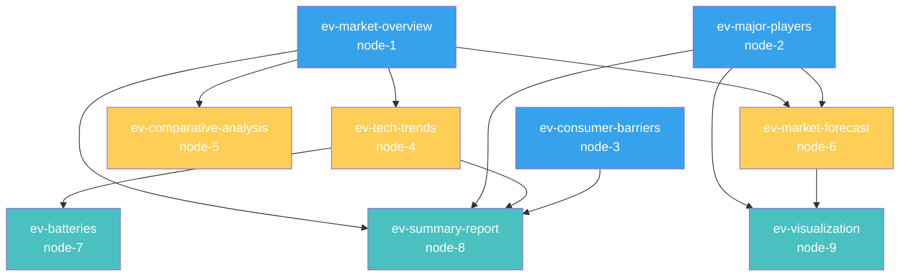

```json
  "stepId": "ev-visualization",
  "nodeId": "node-9",
  "result": {
    "content": "```html\n<!DOCTYPE html>\n<html lang=\"en\">\n<head>\n    <meta charset=\"UTF-8\">\n    <meta name=\"viewport\" content=\"width=device-width, initial-scale=1.0\">\n    <title>电动汽车市场数据可视化</title>\n    <script src=\"https://cdn.jsdelivr.net/npm/chart.js\"></script>\n    <script src=\"https://cdn.jsdelivr.net/npm/chartjs-plugin-datalabels\"></script>\n    <script src=\"https://cdn.jsdelivr.net/npm/chartjs-plugin-annotation\"></script>\n    <style>\n        body {\n            font-family: 'Arial', sans-serif;\n            margin: 0;\n            padding: 20px;\n            background-color: #f8f9fa;\n            color: #333;\n        }\n        .container {\n            max-width: 1200px;\n            margin: 0 auto;\n            background-color: white;\n            border-radius: 10px;\n            box-shadow: 0 4px 12px rgba(0,0,0,0.1);\n            padding: 30px;\n        }\n        h1 {\n            text-align: center;\n            color: #155EEF;\n            margin-bottom: 30px;\n        }\n        .chart-container {\n            margin-bottom: 50px;\n            position: relative;\n        }\n        .chart-title {\n            font-size: 20px;\n            font-weight: bold;\n            margin-bottom: 15px;\n            text-align: center;\n            color: #2c3e50;\n        }\n        .chart-description {\n            font-size: 14px;\n            margin-bottom: 20px;\n            color: #666;\n            text-align: center;\n        }\n        .chart-wrapper {\n            height: 400px;\n            margin-bottom: 30px;\n        }\n        .tabs {\n            display: flex;\n            margin-bottom: 20px;\n            border-bottom: 1px solid #ddd;\n        }\n        .tab {\n            padding: 10px 20px;\n            cursor: pointer;\n            background-color: #f1f1f1;\n            border: 1px solid #ddd;\n            border-bottom: none;\n            border-radius: 5px 5px 0 0;\n            margin-right: 5px;\n        }\n        .tab.active {\n            background-color: white;\n            border-bottom: 1px solid white;\n            margin-bottom: -1px;\n            color: #155EEF;\n            font-weight: bold;\n        }\n        .tab-content {\n            display: none;\n        }\n        .tab-content.active {\n            display: block;\n        }\n        .dashboard-row {\n            display: flex;\n            gap: 20px;\n            margin-bottom: 20px;\n        }\n        .dashboard-item {\n            flex: 1;\n            padding: 20px;\n            background-color: #f8f9fa;\n            border-radius: 8px;\n            box-shadow: 0 2px 4px rgba(0,0,0,0.05);\n        }\n        .dashboard-value {\n            font-size: 24px;\n            font-weight: bold;\n            color: #155EEF;\n            margin-bottom: 5px;\n        }\n        .dashboard-label {\n            font-size: 14px;\n            color: #666;\n        }\n        .source-note {\n            font-size: 12px;\n            color: #999;\n            text-align: center;\n            margin-top: 40px;\n        }\n    </style>\n</head>\n<body>\n    <div class=\"container\">\n        <h1>全球电动汽车市场数据可视化</h1>\n        \n        <div class=\"dashboard-row\">\n            <div class=\"dashboard-item\">\n                <div class=\"dashboard-value\">3850亿美元</div>\n                <div class=\"dashboard-label\">2022年市场规模</div>\n            </div>\n            <div class=\"dashboard-item\">\n                <div class=\"dashboard-value\">1.1万亿美元</div>\n                <div class=\"dashboard-label\">2030年预计市场规模</div>\n            </div>\n            <div class=\"dashboard-item\">\n                <div class=\"dashboard-value\">13.5%</div>\n                <div class=\"dashboard-label\">复合年增长率(CAGR)</div>\n            </div>\n            <div class=\"dashboard-item\">\n                <div class=\"dashboard-value\">71%</div>\n                <div class=\"dashboard-label\">纯电动车市场份额</div>\n            </div>\n        </div>\n        \n        <div class=\"tabs\">\n            <div class=\"tab active\" data-tab=\"market-share\">市场份额</div>\n            <div class=\"tab\" data-tab=\"growth-forecast\">增长预测</div>\n            <div class=\"tab\" data-tab=\"regional-analysis\">区域分析</div>\n            <div class=\"tab\" data-tab=\"tech-trends\">技术趋势</div>\n        </div>\n        \n        <div class=\"tab-content active\" id=\"market-share\">\n            <div class=\"chart-container\">\n                <div class=\"chart-title\">全球电动汽车制造商市场份额 (2022)</div>\n                <div class=\"chart-description\">基于全球电动汽车销量数据</div>\n                <div class=\"chart-wrapper\">\n                    <canvas id=\"manufacturerChart\"></canvas>\n                </div>\n            </div>\n            \n            <div class=\"chart-container\">\n                <div class=\"chart-title\">电动汽车类型分布</div>\n                <div class=\"chart-description\">纯电动(BEV)与插电式混合动力(PHEV)市场份额</div>\n                <div class=\"chart-wrapper\">\n                    <canvas id=\"evTypeChart\"></canvas>\n                </div>\n            </div>\n        </div>\n        \n        <div class=\"tab-content\" id=\"growth-forecast\">\n            <div class=\"chart-container\">\n                <div class=\"chart-title\">全球电动汽车销量预测 (2022-2030)</div>\n                <div class=\"chart-description\">年度销量(百万辆)与市场渗透率(%)</div>\n                <div class=\"chart-wrapper\">\n                    <canvas id=\"salesForecastChart\"></canvas>\n                </div>\n            </div>\n            \n            <div class=\"chart-container\">\n                <div class=\"chart-title\">电池成本下降趋势 (2018-2030)</div>\n                <div class=\"chart-description\">电池包成本(美元/千瓦时)变化趋势</div>\n                <div class=\"chart-wrapper\">\n                    <canvas id=\"batteryCostChart\"></canvas>\n                </div>\n            </div>\n        </div>\n        \n        <div class=\"tab-content\" id=\"regional-analysis\">\n            <div class=\"chart-container\">\n                <div class=\"chart-title\">区域市场销量份额 (2022)</div>\n                <div class=\"chart-description\">全球电动汽车销量的区域分布</div>\n                <div class=\"chart-wrapper\">\n                    <canvas id=\"regionalShareChart\"></canvas>\n                </div>\n            </div>\n            \n            <div class=\"chart-container\">\n                <div class=\"chart-title\">各区域电动汽车渗透率预测 (2023-2030)</div>\n                <div class=\"chart-description\">电动汽车占新车销量百分比</div>\n                <div class=\"chart-wrapper\">\n                    <canvas id=\"penetrationChart\"></canvas>\n                </div>\n            </div>\n        </div>\n        \n        <div class=\"tab-content\" id=\"tech-trends\">\n            <div class=\"chart-container\">\n                <div class=\"chart-title\">电池能量密度发展趋势 (2020-2030)</div>\n                <div class=\"chart-description\">商业电池包能量密度(Wh/kg)预测</div>\n                <div class=\"chart-wrapper\">\n                    <canvas id=\"energyDensityChart\"></canvas>\n                </div>\n            </div>\n            \n            <div class=\"chart-container\">\n                <div class=\"chart-title\">电动汽车技术发展路线图</div>\n                <div class=\"chart-description\">关键技术商业化时间预测</div>\n                <div class=\"chart-wrapper\">\n                    <canvas id=\"techRoadmapChart\"></canvas>\n                </div>\n            </div>\n        </div>\n        \n        <div class=\"source-note\">数据来源：基于市场研究报告、制造商公开数据及行业分析预测综合整理</div>\n    </div>\n\n    <script>\n        // Tab 切换功能\n        document.querySelectorAll('.tab').forEach(tab => {\n            tab.addEventListener('click', () => {\n                // 移除所有active类\n                document.querySelectorAll('.tab').forEach(t => t.classList.remove('active'));\n                document.querySelectorAll('.tab-content').forEach(c => c.classList.remove('active'));\n                \n                // 添加active类到当前tab和对应内容\n                tab.classList.add('active');\n                document.getElementById(tab.getAttribute('data-tab')).classList.add('active');\n            });\n        });\n        \n        // 制造商市场份额图表\n        const manufacturerCtx = document.getElementById('manufacturerChart').getContext('2d');\n        new Chart(manufacturerCtx, {\n            type: 'pie',\n            data: {\n                labels: ['特斯拉', '比亚迪', '大众集团', '通用汽车', '现代-起亚', '宝马集团', '上汽集团', '蔚来/小鹏/理想', '福特', '其他'],\n                datasets: [{\n                    data: [18, 15, 10, 7, 6, 5, 4, 5, 3, 27],\n                    backgroundColor: [\n                        '#FF6384', '#36A2EB', '#FFCE56', '#4BC0C0', '#9966FF',\n                        '#FF9F40', '#2E5BFF', '#C9CBCF', '#8D99AE', '#EF476F'\n                    ]\n                }]\n            },\n            options: {\n                responsive: true,\n                maintainAspectRatio: false,\n                plugins: {\n                    legend: {\n                        position: 'right',\n                    },\n                    tooltip: {\n                        callbacks: {\n                            label: function(context) {\n                                return context.label + ': ' + context.raw + '%';\n                            }\n                        }\n                    }\n                }\n            }\n        });\n        \n        // 电动汽车类型分布图表\n        const evTypeCtx = document.getElementById('evTypeChart').getContext('2d');\n        new Chart(evTypeCtx, {\n            type: 'doughnut',\n            data: {\n                labels: ['纯电动汽车(BEV)', '插电式混合动力(PHEV)'],\n                datasets: [{\n                    data: [71, 29],\n                    backgroundColor: ['#36A2EB', '#FFCE56']\n                }]\n            },\n            options: {\n                responsive: true,\n                maintainAspectRatio: false,\n                plugins: {\n                    legend: {\n                        position: 'bottom',\n                    }\n                }\n            }\n        });\n        \n        // 销量预测图表\n        const salesForecastCtx = document.getElementById('salesForecastChart').getContext('2d');\n        new Chart(salesForecastCtx, {\n            type: 'bar',\n            data: {\n                labels: ['2022', '2023', '2024', '2025', '2026', '2027', '2028', '2029', '2030'],\n                datasets: [{\n                    label: '年销量(百万辆)',\n                    data: [10.3, 14, 18.5, 25, 30.5, 36, 41, 46, 50],\n                    backgroundColor: '#36A2EB',\n                    order: 2\n                }, {\n                    label: '市场渗透率(%)',\n                    data: [14, 18, 22, 28, 33, 37, 40, 42, 45],\n                    type: 'line',\n                    borderColor: '#FF6384',\n                    backgroundColor: '#FF6384',\n                    yAxisID: 'y1',\n                    order: 1\n                }]\n            },\n            options: {\n                responsive: true,\n                maintainAspectRatio: false,\n                scales: {\n                    y: {\n                        beginAtZero: true,\n                        title: {\n                            display: true,\n                            text: '销量(百万辆)'\n                        }\n                    },\n                    y1: {\n                        beginAtZero: true,\n                        position: 'right',\n                        grid: {\n                            drawOnChartArea: false\n                        },\n                        title: {\n                            display: true,\n                            text: '市场渗透率(%)'\n                        },\n                        max: 50\n                    }\n                }\n            }\n        });\n        \n        // 电池成本趋势图表\n        const batteryCostCtx = document.getElementById('batteryCostChart').getContext('2d');\n        new Chart(batteryCostCtx, {\n            type: 'line',\n            data: {\n                labels: ['2018', '2019', '2020', '2021', '2022', '2023', '2024', '2025', '2026', '2027', '2028', '2029', '2030'],\n                datasets: [{\n                    label: '电池成本(美元/kWh)',\n                    data: [180, 160, 145, 138, 130, 120, 110, 100, 90, 80, 75, 70, 65],\n                    borderColor: '#4BC0C0',\n                    backgroundColor: 'rgba(75, 192, 192, 0.2)',\n                    fill: true,\n                    tension: 0.2\n                }]\n            },\n            options: {\n                responsive: true,\n                maintainAspectRatio: false,\n                scales: {\n                    y: {\n                        beginAtZero: false,\n                        title: {\n                            display: true,\n                            text: '美元/kWh'\n                        }\n                    }\n                },\n                plugins: {\n                    annotation: {\n                        annotations: {\n                            line1: {\n                                type: 'line',\n                                yMin: 100,\n                                yMax: 100,\n                                borderColor: '#FF6384',\n                                borderWidth: 2,\n                                borderDash: [5, 5],\n                                label: {\n                                    content: '价格平价点',\n                                    enabled: true\n                                }\n                            }\n                        }\n                    }\n                }\n            }\n        });\n        \n        // 区域市场份额图表\n        const regionalShareCtx = document.getElementById('regionalShareChart').getContext('2d');\n        new Chart(regionalShareCtx, {\n            type: 'pie',\n            data: {\n                labels: ['中国', '欧洲', '北美', '其他地区'],\n                datasets: [{\n                    data: [60, 25, 10, 5],\n                    backgroundColor: ['#36A2EB', '#FFCE56', '#FF6384', '#4BC0C0']\n                }]\n            },\n            options: {\n                responsive: true,\n                maintainAspectRatio: false,\n                plugins: {\n                    legend: {\n                        position: 'right',\n                    },\n                    tooltip: {\n                        callbacks: {\n                            label: function(context) {\n                                return context.label + ': ' + context.raw + '%';\n                            }\n                        }\n                    }\n                }\n            }\n        });\n        \n        // 区域市场渗透率图表\n        const penetrationCtx = document.getElementById('penetrationChart').getContext('2d');\n        new Chart(penetrationCtx, {\n            type: 'line',\n            data: {\n                labels: ['2023', '2024', '2025', '2026', '2027', '2028', '2029', '2030'],\n                datasets: [{\n                    label: '中国',\n                    data: [30, 33, 35, 38, 42, 45, 50, 55],\n                    borderColor: '#36A2EB',\n                    tension: 0.1\n                }, {\n                    label: '欧洲',\n                    data: [20, 23, 28, 33, 37, 40, 45, 50],\n                    borderColor: '#FFCE56',\n                    tension: 0.1\n                }, {\n                    label: '北美',\n                    data: [8, 10, 15, 18, 22, 25, 30, 35],\n                    borderColor: '#FF6384',\n                    tension: 0.1\n                }, {\n                    label: '全球平均',\n                    data: [18, 22, 28, 33, 37, 40, 42, 45],\n                    borderColor: '#4BC0C0',\n                    borderWidth: 3,\n                    tension: 0.1\n                }]\n            },\n            options: {\n                responsive: true,\n                maintainAspectRatio: false,\n                scales: {\n                    y: {\n                        beginAtZero: true,\n                        title: {\n                            display: true,\n                            text: '电动汽车占新车销量百分比(%)'\n                        },\n                        max: 60\n                    }\n                }\n            }\n        });\n        \n        // 电池能量密度趋势图表\n        const energyDensityCtx = document.getElementById('energyDensityChart').getContext('2d');\n        new Chart(energyDensityCtx, {\n            type: 'line',\n            data: {\n                labels: ['2020', '2021', '2022', '2023', '2024', '2025', '2026', '2027', '2028', '2029', '2030'],\n                datasets: [{\n                    label: '主流电池能量密度(Wh/kg)',\n                    data: [170, 180, 200, 220, 250, 280, 300, 330, 350, 375, 400],\n                    borderColor: '#9966FF',\n                    backgroundColor: 'rgba(153, 102, 255, 0.2)',\n                    fill: true,\n                    tension: 0.3\n                }]\n            },\n            options: {\n                responsive: true,\n                maintainAspectRatio: false,\n                scales: {\n                    y: {\n                        beginAtZero: false,\n                        title: {\n                            display: true,\n                            text: '能量密度(Wh/kg)'\n                        }\n                    }\n                }\n            }\n        });\n        \n        // 技术路线图\n        const techRoadmapCtx = document.getElementById('techRoadmapChart').getContext('2d');\n        new Chart(techRoadmapCtx, {\n            type: 'bar',\n            data: {\n                labels: ['高镍NMC电池', '硅基阳极(10%+)', '钠离子电池', '半固态电池', '800V架构', '高镍NMC(90%+)', '硅基阳极(30%+)', '全固态电池', '锂硫电池'],\n                datasets: [{\n                    axis: 'y',\n                    label: '技术商业化时间',\n                    data: [2022, 2023, 2024, 2025, 2025, 2026, 2027, 2030, 2032],\n                    backgroundColor: [\n                        '#36A2EB', '#36A2EB', '#36A2EB', // 已商业化或即将商业化(蓝色)\n                        '#FFCE56', '#FFCE56', '#FFCE56', '#FFCE56', // 中期(黄色)\n                        '#FF6384', '#FF6384' // 长期(红色)\n                    ],\n                    barThickness: 20\n                }]\n            },\n            options: {\n                indexAxis: 'y',\n                responsive: true,\n                maintainAspectRatio: false,\n                scales: {\n                    x: {\n                        beginAtZero: false,\n                        min: 2022,\n                        max: 2033,\n                        title: {\n                            display: true,\n                            text: '预计商业化年份'\n                        }\n                    }\n                }\n            }\n        });\n    </script>\n</body>\n</html>\n```",
    "success": true
  }
}
```

### 第3轮后更新的 Todo.md

```markdown
# Todo: 电动汽车市场研究

## 原始请求
我需要研究电动汽车市场的当前状态，重点关注主要参与者、技术趋势和消费者采用的障碍，并生成一份综合报告和数据可视化。

## 状态
completed

## 当前周期: 3/3

## 任务

### 已完成
- [x] ev-market-overview: 研究全球电动汽车市场概览 (完成于周期 1)
  - 发现: 全球电动汽车市场价值3850亿美元，预计到2030年达到1.1万亿美元。中国占60%市场份额，纯电动车占比71%。主要驱动因素包括政府激励措施、环保法规和技术进步，充电基础设施不足仍是主要挑战。
  - 相关节点: [node-1]
- [x] ev-major-players: 识别并分析主要电动汽车制造商 (完成于周期 1)
  - 发现: 特斯拉(18%)和比亚迪(15%)主导全球市场，大众集团(10%)紧随其后。主要制造商还包括通用汽车、现代-起亚、福特、宁德时代、上汽集团、BMW和中国新兴品牌。主要战略包括垂直整合、平台开发和电池技术投资。
  - 相关节点: [node-2]
- [x] ev-consumer-barriers: 分析消费者采用的障碍 (完成于周期 1)
  - 发现: 主要障碍包括高初始购买成本、续航焦虑、充电基础设施不足、对技术可靠性的顾虑、车型选择有限及对电动车的错误认知。消费者教育、降价、扩充充电设施和延长电池寿命是关键解决方案。
  - 相关节点: [node-3]
- [x] ev-tech-trends: 研究电动汽车领域当前和新兴技术趋势 (完成于周期 2)
  - 发现: 主要技术趋势包括固态电池和钠离子电池等电池技术进步、超快速和无线充电技术、轮毂电机等电驱技术改进、AI驱动的电池管理系统和ADAS整合、结构化电池设计等制造创新以及太阳能集成。这些趋势共同推动续航增加、充电加速和成本降低。
  - 相关节点: [node-4]
- [x] ev-comparative-analysis: 比较传统汽车与电动汽车 (完成于周期 2)
  - 发现: 电动汽车提供即时扭矩和更低噪音，但充电慢于加油；初始成本高20-40%但运营成本低30-60%；EV全生命周期排放低30-70%；EV维护更简单但公共快充网络仍在发展中；续航和充电仍是EV主要限制，但传统车辆依赖波动油价且面临排放标准升级。
  - 相关节点: [node-5]
- [x] ev-market-forecast: 研究电动汽车市场增长预测 (完成于周期 2)
  - 发现: 预计2023年全球销量1400万辆，到2030年达4500-5000万辆，CAGR为19-22%。中国保持最大市场，欧洲有雄心勃勃的转型计划，北美增长较慢。价格预计2026年达到平价点，充电桩将增长至1200万个，车型多样性大增。特斯拉和比亚迪将继续领先，但市场份额分散化。
  - 相关节点: [node-6]
- [x] ev-batteries: 深入研究电池技术进展 (完成于周期 3)
  - 发现: 当前锂离子电池能量密度达250 Wh/kg，成本降至约$130/kWh。关键技术包括高镍NMC阴极、LFP低成本应用、硅基阳极提升能量密度。固态电池预计2025-2026年开始小规模生产，2028-2030年商业化，可提高能量密度50-100%。钠离子电池已初步商业化，成本更低但能量密度较低。电池管理系统引入AI和数字孪生技术优化性能。
  - 相关节点: [node-7]
- [x] ev-summary-report: 创建综合电动汽车市场报告 (完成于周期 3)
  - 发现: 完成了全面的电动汽车市场分析报告，包括市场概览、主要参与者分析、技术趋势、消费者障碍分析、电动车与传统车辆比较、市场预测及战略建议。报告指出电动汽车市场正处于从早期采用者向主流市场转变的拐点，到2030年预计占全球新车销量的35-40%。
  - 相关节点: [node-8]
- [x] ev-visualization: 生成市场份额可视化图表 (完成于周期 3)
  - 发现: 创建了交互式数据可视化网页，包括制造商市场份额饼图、电动汽车类型分布图、销量预测图表、电池成本趋势图、区域市场份额分析、各区域渗透率预测、电池能量密度趋势以及技术路线图。可视化工具使用Chart.js实现，提供了多标签页视图来展示不同维度的市场数据。
  - 相关节点: [node-9]

### 待处理

## 进度摘要
研究项目已全部完成。我们对电动汽车市场进行了全面分析，包括市场现状、主要制造商、技术趋势、消费者障碍、电池技术、未来预测并创建了综合报告和交互式数据可视化。研究表明电动汽车市场增长迅速，到2030年将占全球新车销量的35-40%。电池技术是关键驱动力，固态电池和钠离子电池将在未来10年内成熟。特斯拉和比亚迪目前主导市场，但竞争日益激烈。消费者障碍正通过技术进步和成本降低逐步解决，2026年左右预计达到价格平价点。
```

### 第3轮周期总结

```json
{
  "epoch": 3,
  "completedSteps": ["ev-batteries", "ev-summary-report", "ev-visualization"],
  "findings": "第三周期完成了电池技术深度研究、综合市场报告和数据可视化。电池技术研究显示，当前锂离子电池能量密度达250 Wh/kg，成本约$130/kWh，主要创新包括高镍NMC阴极、硅基阳极、固态电池(预计2028-2030年商业化)和钠离子电池。综合报告全面分析了市场状况、主要参与者、技术趋势、消费者障碍和市场预测，指出电动汽车正从早期采用者向主流市场过渡，到2030年将占全球新车销量35-40%。交互式数据可视化展示了市场份额、增长趋势、电池成本下降和区域差异等关键数据。研究项目成功完成了用户要求的所有任务，提供了全面的电动汽车市场分析。",
  "todoUpdates": {
    "tasksCompleted": ["ev-batteries", "ev-summary-report", "ev-visualization"],
    "tasksAdded": [],
    "tasksModified": []
  },
  "nextSteps": "所有任务已完成，工作流程已结束。如果用户需要，可以进一步研究特定区域市场或细分领域，如商用电动车市场、充电基础设施发展或二手电动车市场前景。"
}
```

## 完整工作流可视化



每个节点按所在周期分组颜色标记：
- 蓝色: 第1轮节点
- 黄色: 第2轮节点
- 绿色: 第3轮节点

此工作流展示了如何从初始市场研究逐步深入到详细分析，最后生成综合报告和可视化，完成了一个完整的市场研究项目生命周期。
