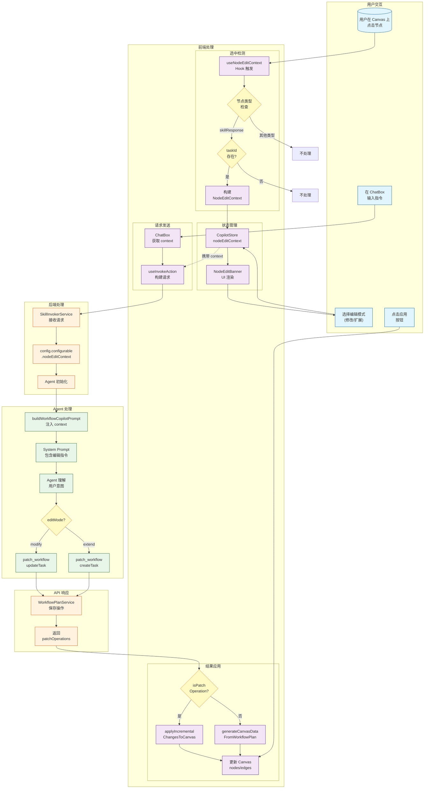
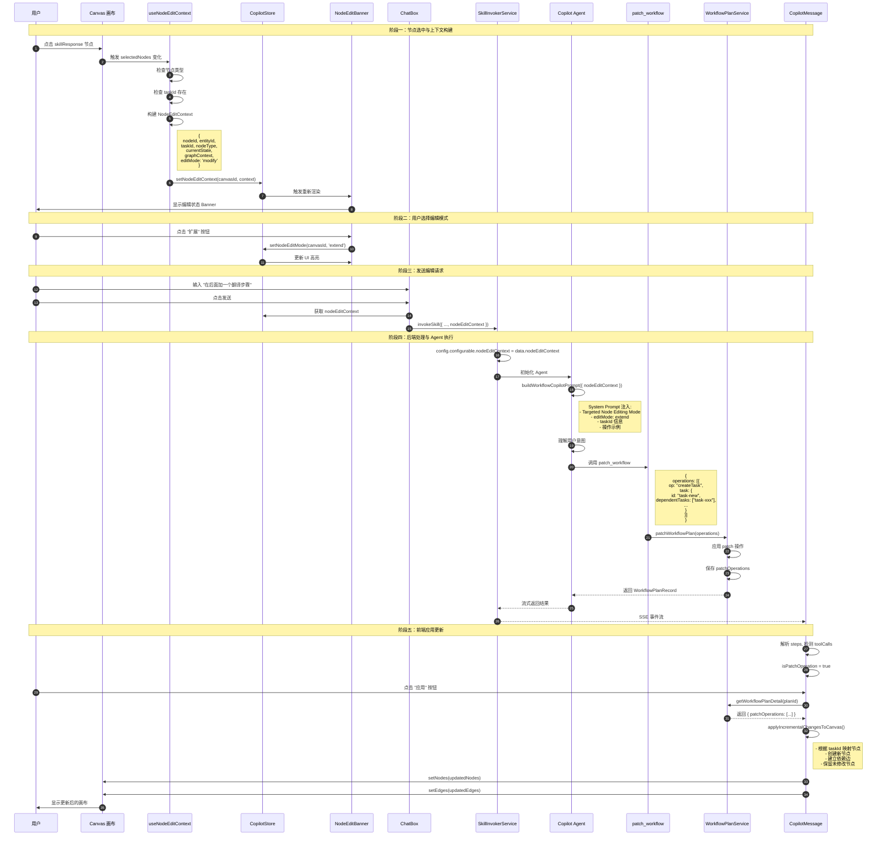
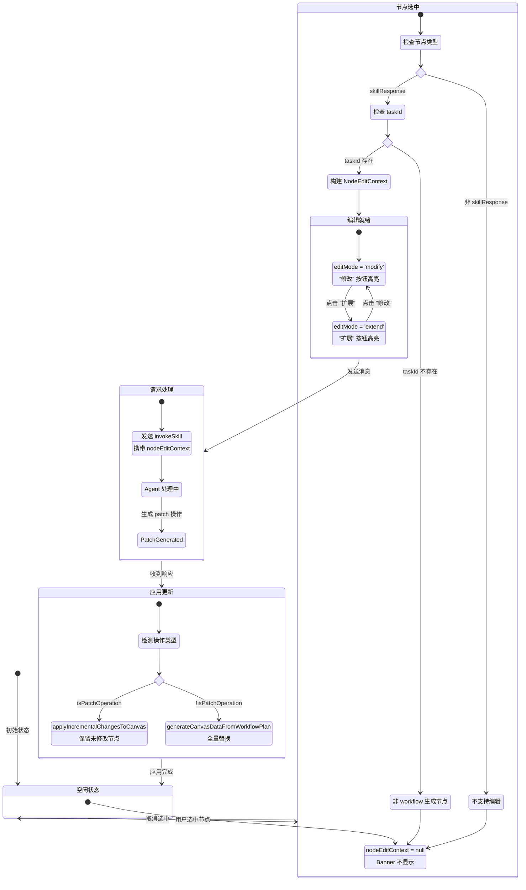
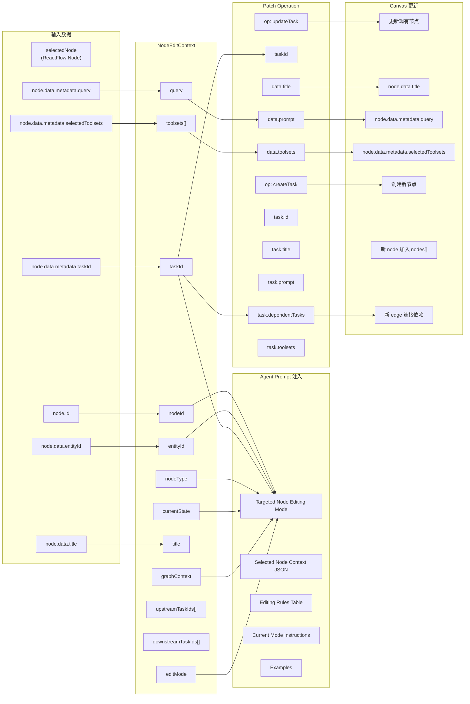
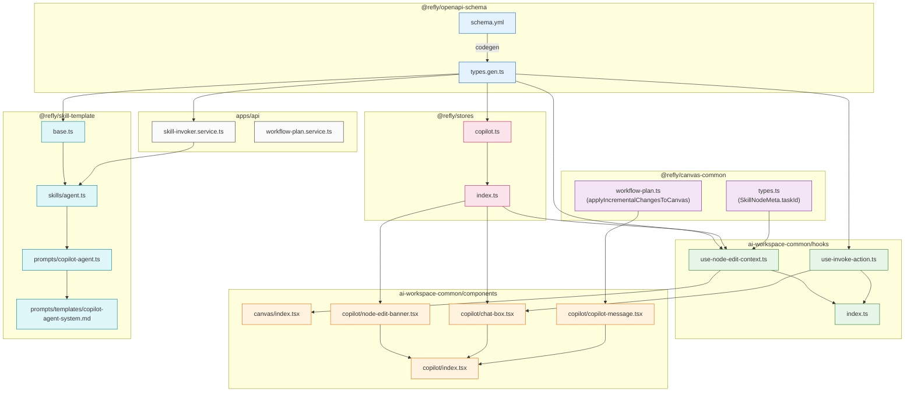
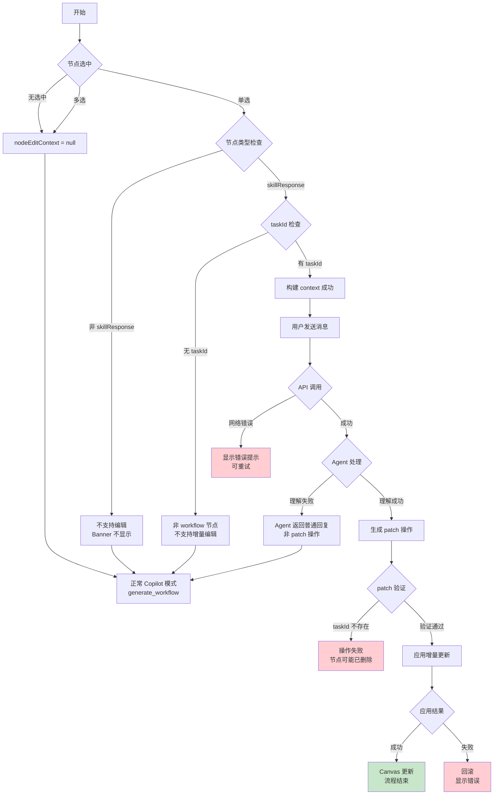
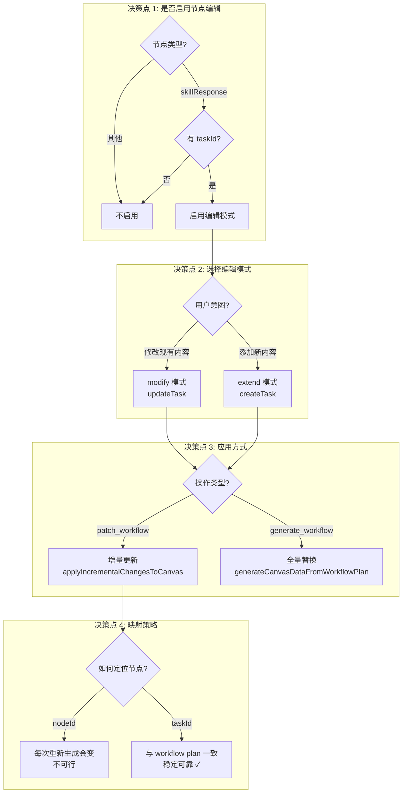

# Node Edit Context 实现流程图

## 1. 整体架构流程

---

## 2. 详细时序图

---

## 3. 状态流转图

---

## 4. 数据结构流转

---

## 5. 文件依赖关系

---

## 6. 错误处理流程

---

## 7. 关键决策点

---

*流程图使用 Mermaid 语法编写，可在支持 Mermaid 的 Markdown 查看器中渲染*
