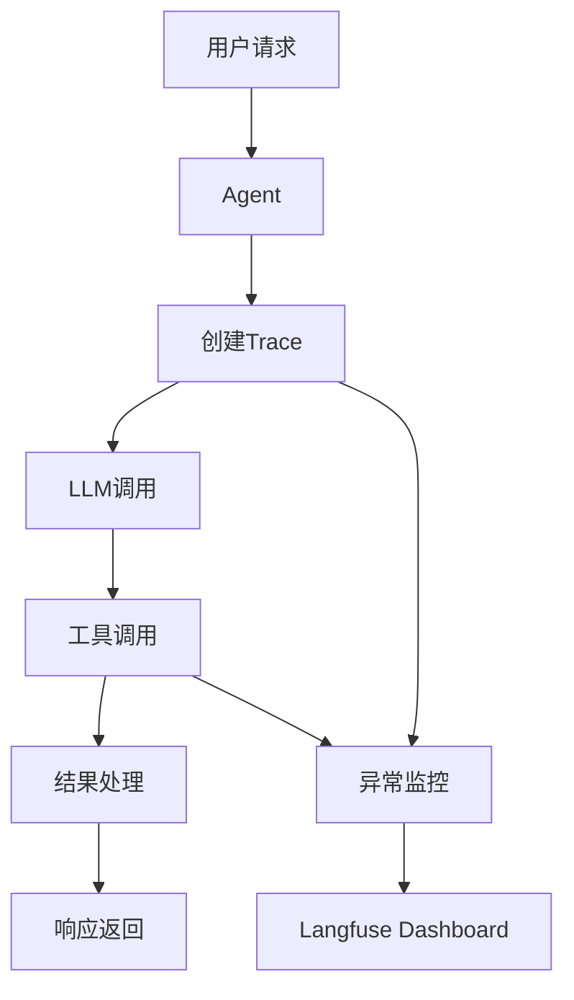
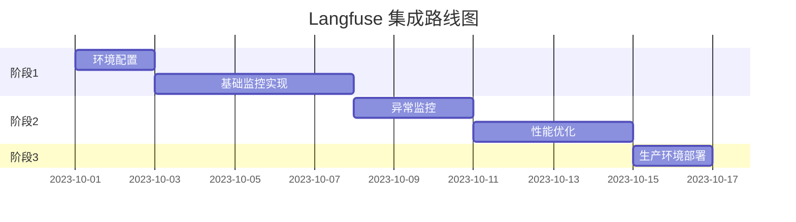

# Langfuse 监控集成方案

## 1. 目标
集成 Langfuse 实现对"问问"功能和 MCP 工具调用的全面监控，包括：
- 用户请求追踪
- LLM 调用性能分析
- MCP 工具执行监控
- 异常错误追踪

## 2. 架构设计


## 3. 核心组件
### 3.1 Trace 管理器
- 每个用户请求创建唯一 Trace ID
- 记录请求元数据：用户ID、技能名称、模型信息

### 3.2 Span 记录器
- 监控关键操作耗时：
  - LLM 调用
  - 工具执行
  - 结果处理
- 记录输入/输出数据

### 3.3 元数据收集器
- 环境信息
- 模型配置
- 性能指标

### 3.4 安全过滤器
- 敏感数据脱敏
- PII 信息过滤
- 数据采样控制

## 4. 实施步骤

### 4.1 初始化配置
```typescript
// packages/observability/index.ts
import { Langfuse } from 'langfuse';

export const observability = {
  langfuse: null as Langfuse | null,
  
  init() {
    this.langfuse = new Langfuse({
      secretKey: process.env.LANGFUSE_SECRET_KEY,
      publicKey: process.env.LANGFUSE_PUBLIC_KEY,
      baseUrl: process.env.LANGFUSE_HOST || 'https://cloud.langfuse.com'
    });
  },
  
  getTrace(metadata: Record<string, any>) {
    if (!this.langfuse) this.init();
    return this.langfuse!.trace(metadata);
  }
};
```

### 4.2 agent.ts 集成
```typescript
// packages/skill-template/src/skills/agent.ts
import { observability } from '../../observability';

export class Agent extends BaseSkill {
  agentNode = async (state, config) => {
    const trace = observability.getTrace({
      name: `${this.name}问答`,
      userId: user.id,
      metadata: {
        skill: this.name,
        model: config.model
      }
    });

    const rootSpan = trace.span({ name: "请求处理" });
    
    try {
      // 记录输入
      rootSpan.update({ input: state.messages });
      
      // 执行原有逻辑
      const result = await compiledLangGraphApp.invoke(...);
      
      // 记录输出
      rootSpan.update({ output: result.messages });
      trace.update({ output: result.messages });
      
      return result;
    } catch (error) {
      rootSpan.update({ error });
      trace.update({ error });
      throw error;
    } finally {
      rootSpan.end();
      trace.end();
    }
  }
}
```

### 4.3 client.ts 工具监控
```typescript
// packages/skill-template/src/adapters/client.ts
import { observability } from '../../observability';

export class MultiServerMCPClient {
  async callTool(toolName: string, args: any) {
    const currentTrace = observability.getCurrentTrace();
    
    const toolSpan = currentTrace.span({
      name: `工具:${toolName}`,
      input: args,
      metadata: {
        server: this.serverName
      }
    });
    
    try {
      const result = await this._executeTool(toolName, args);
      toolSpan.update({ output: result });
      return result;
    } catch (error) {
      toolSpan.update({ error });
      throw error;
    } finally {
      toolSpan.end();
    }
  }
}
```

### 4.4 环境配置
```env
# .env 文件添加
LANGFUSE_SECRET_KEY=your_secret_key
LANGFUSE_PUBLIC_KEY=your_public_key
LANGFUSE_HOST=https://cloud.langfuse.com

# 可选调试配置
LANGFUSE_DEBUG=true
```

## 5. 高级功能
| 功能 | 描述 | 状态 |
|------|------|------|
| 性能分析 | 记录各阶段耗时 | 阶段1 |
| 错误追踪 | 集成 Sentry | 阶段2 |
| 用户行为分析 | 跟踪对话路径 | 阶段3 |
| 成本监控 | 计算 token 使用量 | 阶段3 |

## 6. 部署路线图


## 7. 验证计划
1. **开发环境测试**
   - 验证基础监控功能
   - 测试 Trace/Span 创建
2. **集成测试**
   - 模拟工具调用验证链路追踪
   - 异常场景测试
3. **性能测试**
   - 压力测试监控系统影响
   - 资源消耗评估
4. **生产部署**
   - 灰度发布
   - 实时监控验证

## 8. 预期效果
- 可视化 LLM 调用链
- 降低调试时间 40%
- 提升异常诊断效率
- 优化资源利用率